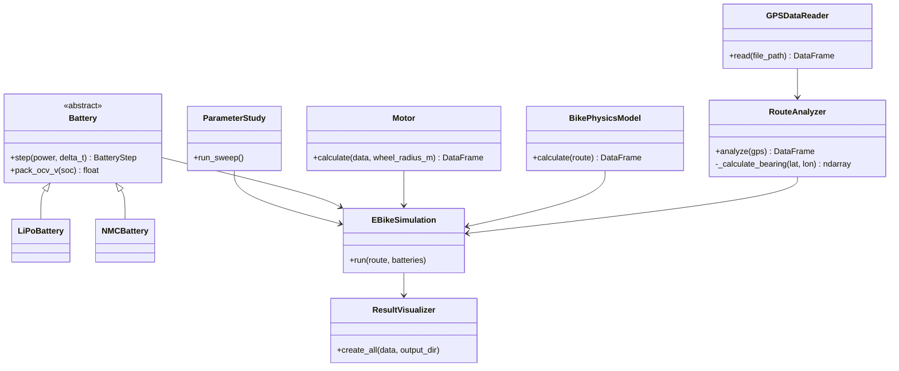
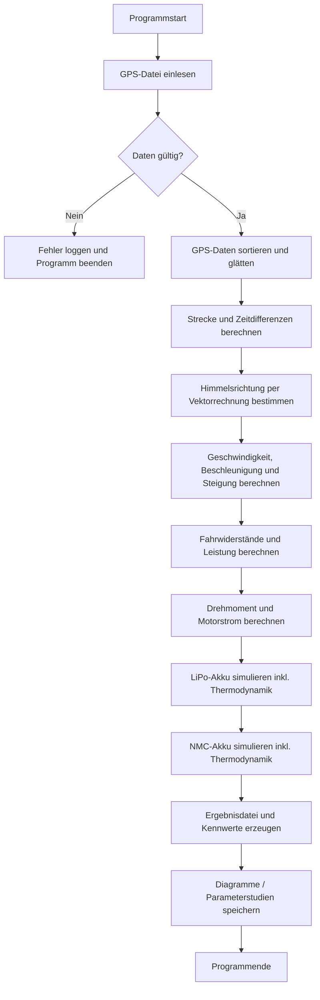

# GPS-basierte E-Bike-Simulation

Dieses Projekt liest GPS-Daten ein und berechnet daraus Strecke, Geschwindigkeit,
Beschleunigung, Steigung, Fahrwiderstände, Motorleistung, Drehmoment, Motorstrom
sowie den Ladezustand eines LiPo- und eines NMC-Akkus und viele weitere Werte. Zusätzlich werden die genaue Himmelsrichtung der Route sowie umfassende Parameterstudien ausgewertet mit Grafiken und Werten.

## Modellparameter

Vorgegebene Fahrradwerte:

- Fahrermasse: 70 kg
- Fahrradmasse: 10 kg
- Produkt `c_w * A`: 0,5625 m²
- Raddurchmesser: 27 inch
- Motorkonstante: 1,5 Nm/A

Akkus:

- 10SxP
- Nennspannung: 3,7 V/Zelle
- Spannungsbereich: 3,2 bis 4,2 V/Zelle
- LiPo-Innenwiderstand: 8 mOhm/Zelle
- NMC-Innenwiderstand: 7 mOhm/Zelle
- OCV-SOC-Kennlinien entsprechend der Aufgabenstellung
- Dokumentation der thermischen Startparameter und des dynamischen Akku-Verhaltens
- Start- und Umgebungstemperatur: standardmäßig 20 °C (inkl. dynamischer Thermodynamik, Wärmekapazität und Kühlkoeffizient)

Da weder `x` noch die Zellkapazität vorgegeben wurden, verwendet `main.py`
standardmäßig **10S4P mit 3,0 Ah pro Zelle**. Das entspricht nominell etwa
444 Wh. Diese beiden Werte können direkt in `main.py` verändert werden.

## Installation

Im Hauptorder der Datei:

```bash
python -m venv .venv
```

Windows:

```bash
.venv\Scripts\activate
```

Linux/macOS:

```bash
source .venv/bin/activate
```

Pakete installieren über git Bash im Hauptordner:

```bash
pip install -r requirements.txt
pip install -e .
```

## Erwartetes CSV-Format

```csv
timestamp,latitude,longitude,elevation_m
2026-01-01T10:00:00Z,47.0,11.0,500.0
```

Viele deutsche und englische Alternativnamen werden automatisch erkannt,
beispielsweise `Zeitstempel`, `Breitengrad`, `Längengrad` und `Höhe`.

## Start
Hauptprogramm ausführen in VS Code (Terminal):

```bash
python main.py data/final_project_input_data.csv
```

Parameterstudien ausführen in VS Code (Terminal):

```bash
python src/ebike_sim/parameter_studies.py
```

Optional für die Hauptsimulation:

```bash
python main.py meine_fahrt.csv --output-dir ergebnisse
python main.py meine_fahrt.csv --delimiter ";"
python main.py meine_fahrt.csv --no-smoothing
```

## Ergebnisse

Im Ausgabeordner (output) entstehen:

- `simulation_results.csv`
- `summary.txt`
- `simulation.log`
- Diagramme zu Geschwindigkeit, Beschleunigung, Höhe, Leistung, Drehmoment,
  Motorstrom, Batteriestrom, Ladezustand, Akkuspannung, Akkutemperatur,
  Bremswiderstand und Motorleistung

## Physikalisches Modell

Die notwendige Kraft wird berechnet als:

```text
F = m*a + m*g*sin(phi) + c_r*m*g*cos(phi) + 0.5*rho*c_w*A*v²
```

Die mechanische Leistung ist:

```text
P = F*v
```

Das Drehmoment am Rad ist:

```text
T = F_motor*r
```

Der vereinfachte Motorstrom ist:

```text
I_motor = T / K_m
```

Der Batteriestrom wird zusätzlich aus Open-Circuit-Spannung und
Innenwiderstand berechnet:

```text
P = (U_oc - I*R)*I
```

## Wichtige Modellgrenzen

GPS-Höhen- und Positionswerte enthalten Messrauschen. Das Programm glättet
deshalb Höhe und Geschwindigkeit. Für eine wissenschaftlich belastbare
Auslegung sollten die Filterparameter anhand des echten Datensatzes geprüft
werden.

Die Aufgabenstellung nennt keine Fahrerleistung, keine konkrete Zellkapazität,
keine Parallelzahl, keinen Rollwiderstand und keinen Motorwirkungsgrad.
Diese Werte sind deshalb konfigurierbar und in `SimulationConfig` dokumentiert.

## Berechnung der Luftdichte

Die Luftdichte wird während der Simulation für jeden Streckenpunkt aus
der Höhe über dem Meeresspiegel und der Umgebungstemperatur berechnet.
Hierzu werden die barometrische Höhenformel und die ideale Gasgleichung
verwendet.

Die berechnete Luftdichte fließt direkt in die Berechnung der
Luftwiderstandskraft ein und ersetzt den zuvor verwendeten konstanten
Luftdichtewert.

Es wird von trockener Luft ausgegangen; der Einfluss der Luftfeuchtigkeit
wird nicht berücksichtigt.

## Automatisch erzeugter Fahrtbericht

Nach Abschluss der Simulation wird zusätzlich ein einfacher
LaTeX-Bericht erzeugt. Dieser enthält die wichtigsten Ergebnisse
der Fahrt, einen Vergleich der verwendeten Akkumodelle, die
berechnete Luftdichte sowie ausgewählte Diagramme der Simulation.

Der Bericht wird als `fahrtbericht.tex` im Ausgabeordner gespeichert
und kann anschließend mit LaTeX oder Overleaf als PDF erstellt werden.

## Unit Tests

Die Unit Tests können mit folgendem Befehl ausgeführt werden:

```bash
python -m pytest
```
## UML-Klassendiagramm



## Aktivitätsdiagramm


